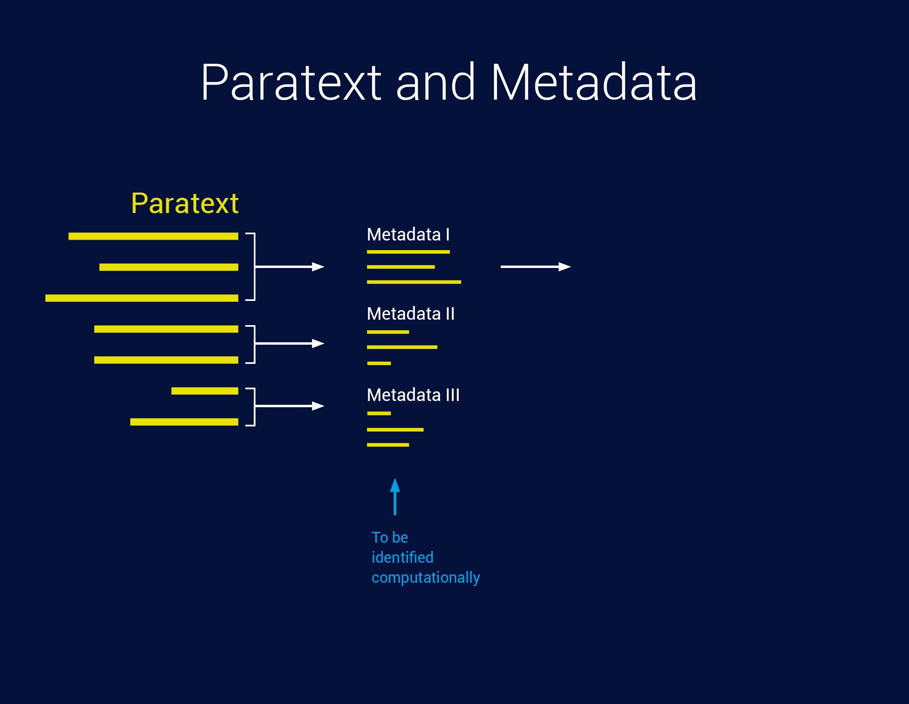

# Paratext and Metadata

Besides the content data, the paratext of research data contains different types of additional metadata. We cite the recommended metadata of the RDA,[^rda] and OpenAIRE:[^oair1]

>Metadata is data providing information about data that makes findable, trackable and (re)usable. It can include information such as contact information, geographic locations, details about units of measure, abbreviations or codes used in the dataset, instrument and protocol information, survey tool details, provenance and version information and much more.

The recommended set of paratext data will be discussed at the beginning of the NFDI4SD in workshops and expert consultations. Metadata will satisfy the required core (e.g. Dublin core,  Datacite and OpenAIRE). We, therefore, apply the proposal of [Datacite](http://schema.datacite.org/meta/kernel-4.3/doc/DataCite-MetadataKernel_v4.3.pdf). Following considerations might be taken into account:

  - Paratext data will best be coded as [JSON-LD](https://json-ld.org/) format, which as a lightweight Linked Data format allows a standardized API for complex hierarchical data structures. Its standards are ideal for an interoperable API, REST-services and Web interface.[^ld]Transformations into other formats and standards are planned.
  - Core metadata, as required by ZENODO and generic data repositories, will be included in the set of metadata.
  - Paratext will consist of the provenance of data to allow the composition of a data dependency graph. It will enable functions for the NFDI4SD registry to administer data dependencies and informative navigation through data repositories to the researcher.
  - Many data provider - e.g. Bayerischer Staatsbibiothek München - as a pivotal content provider for digital ressources, has tagged exceptionally well their more than 2.5 mio digital objects and provides various RDF and XML structured metafiles. Their schema will be transparently used for the subsequent processing of research data for our researcher. A maximum of coherence of data and metadata is intended.
  - Meaningful data APIs will be created along the lines of [API](https://rollout.io/blog/json-ld-building-meaningful-data-apis/) considerations.
  - Machine learning tools of the NFDI4SD will supply flexible mapping between user-specific terminology and data standards.
  - Sufficient documentation of data, their origin, units, explanation of terms and cross-linking to standards of definition are recommended and will be assisted by appropriate tools using research feedback from the specific research community.
  - There is a discussion about the advantage of [Structured Data Transformation (SDTL)](https://ddialliance.org/announcement/public-review-structured-data-transformation-language-sdtl) which addresses the issue of data provenance.[^sdtl1] A proposal is under review.

[^ld]:[Information about json-ld linked data](https://json-ld.org/learn.html)

[^sdtl1]: [Version 1.0](http://c2metadata.gitlab.io/sdtl-docs/master/summary/) and [c2meta](http://c2metadata.org/)

[^oair1]: [metadataOpenAIRE](https://www.openaire.eu/what-is-metadata#:~:text=Some%20specific%20examples%20of%20metadata,economic%20sciences%2C%20including%20survey%20data)

[^rda]: [rda Metadata Standards Directory Working Group](http://rd-alliance.github.io/metadata-directory/)
